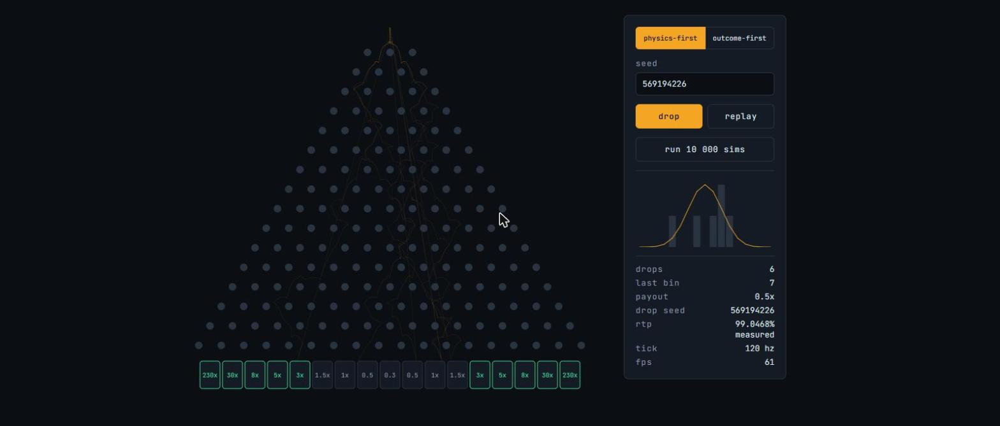

# Deterministic Plinko

**[Play it →](https://mikedavisrocha.github.io/deterministic-plinko/)**



A complete 2D game in **Pixi.js v8**, running on a physics solver written from
scratch — no physics engine. Every collision, bounce and landing is code in this
repository, tuned by measurement rather than by feel, and the whole simulation
runs headless as easily as it renders.

It ships two game modes on one board, and they run **the same solver, the same
geometry and the same trajectories**. What differs is who decides where the disc
lands: in one the physics decides, in the other the outcome is committed to
before the disc moves and the board is steered to it. Both pay the same return
to player by opposite routes.

| | Physics-First | Outcome-First |
|---|---|---|
| Who decides the bin | the simulation | a provably fair commitment, before the disc moves |
| Distribution | measured, not binomial | binomial by construction |
| Payout table | Derived, solved against the measurement | the industry Reference Table, unchanged |
| RTP at medium risk | **99.0468%**, measured over 100 000 000 drops | **98.9883%** exactly — 64873/65536 |
| Edge multiplier at medium | 230x | 110x |

Neither figure is quotable without saying which mode and which risk produced
it. One is a measurement with a sample size behind it; the other is a rational
number.

## The game

You have a balance and you choose a bet, so the multiplier finally has
something to act on. The one real decision a Plinko board offers is **risk** —
low, medium and high all pay about 98.99% and differ only in where the money
sits. Low never pays under 0.5x and tops out at 34x; high pays 0.2x across five
middle bins to fund a 2100x edge. Same expected value, completely different
ride.

Both modes take the risk level, and Physics-First solves a separate table for
each against the same measured distribution — three risks, one measurement, no
regeneration, because the distribution does not depend on what the bins pay.

The session prints what you wagered, what came back, and the ratio between them
next to the target. Over a few hundred drops it visibly walks towards the figure
above it, which is the most honest advertisement the mathematics has: you watch
the RTP happen rather than being told it.

Adding the second and third tables also exposed a bug worth naming. The
rounding grid put everything from 1x to 10x on half-steps, which the medium
table survives untouched because its body is already 1.5, 1, 0.5, 0.3. The low
table lives entirely between 0.5x and 1.6x, so 1.1 and 1.2 both rounded to 1.0
and **it paid 94.52% instead of 98.99%** — four and a half points lost to a
rounding function, under a green test suite that had only ever seen one table.
See [ADR 0007](docs/adr/0007-risk-is-a-choice-between-volatilities.md).

## The physics

**Fixed timestep with an accumulator.** Physics advances in constant 1/120 s
slices no matter the frame rate, with the leftover handed to the renderer as an
interpolation alpha — so motion stays smooth at 60 Hz while the simulation stays
identical on every machine. Semi-implicit Euler: velocity first, then position,
which is energy-stable at the same cost as the naive form.

**Tunneling is handled by invariant, not brute force.** Rather than shrinking
the timestep until the disc stops passing through pegs, velocity is clamped so
`maxSpeed × dt < discRadius + pegRadius` always holds — no discrete step can
skip a peg. At the shipped tuning the clamp never actually binds, so it costs
nothing and cannot be the thing that changes a trajectory.

**Collision resolution in three parts**: positional correction out of
penetration, a velocity response that skips already-separating contacts (without
that guard the disc sticks and jitters on a peg), and tangential friction. Exact
overlap is caught and given a deterministic normal, because dividing by a zero
distance poisons the entire run with NaN.

**A broad phase that provably doesn't change the answer.** Pegs are indexed by
row; a row whose `y` is further than the contact radius cannot hold a collision,
and neither can a peg whose `x` is. Both tests are implied by the distance test
they replace, so the trajectory is identical bit for bit — it just stops
computing ~160 square roots per step.

**Tuned to a feel, then measured.** Fall time is a target in its own right, not
a consequence: the board is tuned to land at 4.035 simulated seconds, long
enough to watch and short enough to want another. Lateral drag is what makes the
walk read as a proper Plinko rather than a disc skating down one side.

## Feel

Peg contacts flash, the trail fades behind the disc, and every trajectory bakes
into a persistent low-alpha texture — after a few hundred drops the board has
drawn its own distribution without a chart.

Landing is scaled by what the bin paid, on a log curve because the table spans
0.3x to 230x: the bin lights and its label pops, sparks fan out of the mouth,
and the screen shakes in proportion. A 0.3x gets a shrug; 230x shakes.

**Audio is synthesised at runtime** — no files, no fetch, nothing to 404. That
is also the only way to make a peg click *follow the physics*: pitch and volume
come from the impact speed the solver just produced, so the board sounds busy
while the disc is fast and thins out as it settles. Wins climb a pentatonic
scale, further the bigger they are, so the payout is audible before you read it.
Muting is remembered between sessions.

None of it can reach the simulation. The presentation layer reads the world and
never writes to it, which is what keeps a muted replay bit-identical to a loud
one.

## The mathematics

**A solver cannot be tuned to an RTP target.** Sweeping restitution 0.10–0.70
and gravity 900–3000 produced measured RTPs from 42% to 2813%, because the
outermost bins pay 110x and one drop in a thousand landing there moves RTP by
eleven points. So RTP is fixed at the payout table instead: Outcome-First draws
from a binomial and uses the industry table unchanged, while Physics-First keeps
its honest distribution and pays from a table solved against *that*. The solve is
contribution-preserving — `m[i] = reference[i] × binomial[i] / measured[i]` — so
each bin returns what the same bin returns in the other mode, matching the
volatility and not merely the total. It prints 230x where the industry prints
110x, and that visible divergence is the result, not an embarrassment.

**The distribution is measured, not assumed.** 100 million headless drops, 21
minutes across 11 shards, committed as a build artefact with the sample count
behind it — because the tail entries need far more samples than the body, and
the Derived Table is only as good as its tail estimates. Bin 0 lands 700 times
in 100 million: a 3.8% relative standard error, and the reason the run is that
size. A fingerprint of every number that can move a trajectory ships with it, so
changing gravity fails the suite with a regenerate-me message instead of quietly
shipping a payout table solved against a board that no longer exists.

**The measured lopsidedness turned out to be the sample's, not the board's.**
The counts came out asymmetric at chi-square 26.5 on 8 df, p = 8.5e-4. Geometry
rules out contact-ordering bias, and a drop has exactly one random input — spawn
jitter — so on a mirror-image board the map from jitter to bin must be
antisymmetric. It holds for 1 000 000 pairs without one exception. The
asymmetry belongs to which jitters the PRNG hands out for sequential seeds, so
the table is solved against the symmetrised counts, under a licence a test can
revoke.

**Provably fair, in the scheme players can actually check.** HMAC-SHA256 keyed
with the server seed over `clientSeed:nonce:round`, bytes taken four at a time
into floats, one float per row deciding left or right. Deliberately the industry
construction rather than a tighter one of our own: a player verifies with a
third-party verifier they already trust, and a scheme only this page can
reproduce gives up the property it is named for. SHA-256 and HMAC are written
out by hand — WebCrypto is async and the drop path is not — and checked against
the published FIPS 180-4 and RFC 4231 vectors, including the longer-than-a-block
key case that short seeds never reach.

**Steering is a lookup, not an intervention.** The measurement run also records
the first 128 seeds that settle in each bin; the commitment names a bin, then
picks a seed from that bin's pool. The solver then runs exactly the drop it
would have run in the other mode. Searching for a seed live was rejected on
numbers: bin 0 is one drop in 65 536 under the commitment but one in ~143 000
under the physics, so the search that costs nothing in the body costs ten
seconds in the tail — and capping the attempts is precisely what a commitment
forbids.

## Engineering

**Bit-exact determinism.** The seeded PRNG is consumed once at spawn; `step()`
is a pure function of the previous state. The same seed replays the same
trajectory, verified by comparing 4-tuples of position and velocity with strict
equality, and pinned by committed hashes of the raw float bit patterns — because
two engines that disagree by one ULP print identical `toFixed(6)` and differ
where it matters. `Math.hypot`, `Math.random` and `Date.now` are banned in the
solver and in the fairness code, and a test reads the sources to enforce it.

**Simulation decoupled from rendering.** Nothing under `src/sim/` imports Pixi,
which is what makes the Monte Carlo trivial. On an AMD Ryzen 5 5500 under Node
24: **10 000 physics drops in 531 ms** (53 µs each) and **10 000 commitment
draws in 282 ms** (28 µs each).

## Numbers worth knowing

- 16 rows, 17 bins, mean fall 4.035 simulated seconds — a tuning target, not a
  consequence
- Physics is binomial through the body and not in the tail: bins 3–13 land
  within 0.6% of binomial, the outermost pair at 0.46× and the next at 1.36×
- 3 drops in 100 million never settle. They are named in the artefact and
  replayable one by one; Outcome-First cannot draw them, because only settled
  drops enter a seed pool
- 108 tests, including all 2 176 indexed seeds re-simulated on every run to
  confirm each lands in the bin it is filed under

## Run it

```bash
npm install
npm run dev
```

```bash
npm test         # 108 tests
npm run measure  # regenerate the distribution + seed index — 21 min, 11 shards
npm run symmetry # sweep a million mirrored spawn pairs
npm run golden   # print trajectory hashes, to compare across engines
```

## Decisions

The reasoning lives in [`docs/adr/`](docs/adr), and the domain language in
[`CONTEXT.md`](CONTEXT.md).

1. [Two payout tables, one RTP target](docs/adr/0001-two-payout-tables-one-rtp-target.md)
2. [No `Math.hypot` in the solver](docs/adr/0002-no-math-hypot-in-the-solver.md)
3. [Lateral drag is what makes the walk binomial](docs/adr/0003-lateral-drag-is-what-makes-the-walk-binomial.md)
4. [The measured lopsidedness is the sample's, not the board's](docs/adr/0004-the-measured-lopsidedness-is-the-samples-not-the-boards.md)
5. [The Target Bin is drawn from the commitment](docs/adr/0005-the-target-bin-is-drawn-from-the-commitment.md)
6. [Outcome-First steers by seed index](docs/adr/0006-outcome-first-steers-by-seed-index.md)
7. [Risk is a choice between volatilities, not between values](docs/adr/0007-risk-is-a-choice-between-volatilities.md)

## Stack

Pixi.js v8 · TypeScript · Vite · Vitest
